# @red5g/cli

CLI para instalar y configurar el flujo de trabajo **red5g-essentials** para Claude Code.

Integra **OpenSpec** (planificación) + **Essentials** (ejecución) + **auditor de calidad** + **ruff** + **ClickUp MCP** en 7 comandos simples.

<p align="center">
  
</p>

## Instalación rápida

```bash
mkdir mi-proyecto && cd mi-proyecto
npx @red5g/cli init --template backend-mysql --scaffold
```

## Qué instala

| Componente | Qué hace |
|------------|----------|
| **OpenSpec** | Planificación con specs (`/opsx:explore`, `/opsx:propose`, `/opsx:archive`) |
| **ruff** | Linter + formatter de Python (hook bloqueante) |
| **Beads** | Memoria persistente entre sesiones (opcional) |
| **Plugin red5g** | 7 commands + 2 agents + 2 skills + 1 hook en `.claude/` |
| **ClickUp MCP** | Conexión directa a ClickUp para leer/escribir tareas (`.mcp.json`) |
| **CLAUDE.md** | Guía del proyecto para Claude Code |
| **Scaffold** | Estructura de carpetas con archivos base (opcional) |

> **Nota:** El plugin [Essentials](https://github.com/GantisStorm/essentials-claude-code) se instala desde dentro de Claude Code (no se puede automatizar desde fuera).

## Comandos del CLI

### `red5g init`

```bash
# Interactivo
npx @red5g/cli init

# Directo
npx @red5g/cli init --template backend-mysql --scaffold

# Sin preguntas
npx @red5g/cli init -t backend-mysql -s -y

# Sin instalar herramientas globales
npx @red5g/cli init -t backend-mysql -s --skip-tools
```

### `red5g doctor`

```bash
npx @red5g/cli doctor
```

Verifica: Node ≥20.19, git, Claude Code, OpenSpec, ruff, Beads, tmux, repo git, CLAUDE.md, pyproject.toml, ClickUp MCP, plugin instalado.

### `red5g update`

```bash
npx @red5g/cli update        # Actualiza commands/agents/skills/hooks
npx @red5g/cli update --force # Sin preguntar
```

## Flujo de trabajo

Después de `init`, dentro de Claude Code:

```
# Feature desde cero
/rg:explore <qué investigar>
/rg:plan <nombre del feature>
/rg:execute
/rg:archive

# Feature desde HU del PM
/rg:feasibility <hu.md o URL de ClickUp>
/rg:plan <nombre del feature>
/rg:execute
/rg:archive

# Bugs rápidos
/rg:fix <descripción del bug>

# Auditoría manual
/rg:audit src/services/
```

### Qué orquesta cada comando

| Comando | Por debajo |
|---------|-----------|
| `/rg:feasibility` | Lee HU + codebase → genera `feasibility.md` → postea feedback en ClickUp |
| `/rg:explore` | → `/opsx:explore` — investiga el codebase |
| `/rg:plan` | Lee `exploration.md` o `feasibility.md` → `/opsx:propose` → plan Essentials → genera tests → pausa para aprobación |
| `/rg:execute` | → `/plan-loop` con exit criteria = pytest + ruff, auditor por tarea |
| `/rg:archive` | → `/opsx:archive` — archiva specs |
| `/rg:fix` | → investigación rápida → `/implement-loop` con ruff como exit criteria + auditor |
| `/rg:audit` | → delega al agente `code-auditor` para revisión de calidad |

## Después de init

Dentro de Claude Code, instala Essentials (una sola vez):

```
/plugin marketplace add GantisStorm/essentials-claude-code
/plugin install essentials@essentials-claude-code
```

Essentials provee los motores de ejecución: `/implement-loop`, `/plan-loop`, `/plan-swarm`, `/plan-team`.

## Templates

| Template | Stack |
|----------|-------|
| `backend-mysql` | Python 3.13 + Serverless Framework v3 + AWS Lambda + MySQL + SQLAlchemy ORM |
| `generic` | Template vacío para configurar manualmente |

## Requisitos

| Herramienta | ¿Requerida? | Se instala automáticamente |
|-------------|-------------|---------------------------|
| Node.js ≥20.19 | Sí | No |
| git | Sí | No |
| Claude Code | Sí | No |
| OpenSpec | Sí | Sí |
| ruff | Sí | Sí |
| Beads | Opcional | Sí |
| Essentials plugin | Sí | No (se instala dentro de Claude Code) |
| tmux | Opcional | No (solo para `/plan-team`) |

## Licencia

MIT
